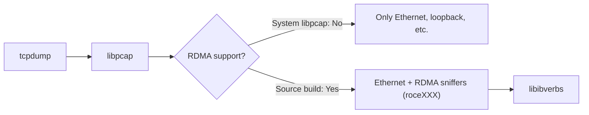

# Building tcpdump with RDMA Sniffing Support on NVIDIA GB10

## Context

I have an NVIDIA Project Digits GB10 (Grace Blackwell) with InfiniBand / RoCE interfaces. Needed to capture RDMA traffic for debugging, but the stock `tcpdump` on Ubuntu couldn't see any RDMA devices.

It listed Ethernet, loopback, Wi-Fi, even D-Bus sockets -- but no RDMA sniffers. Without packet capture on RDMA interfaces, you're guessing when debugging connectivity, performance, or whether traffic is actually taking the RDMA path.

The fix: build `libpcap` and `tcpdump` from source. Current libpcap has a built-in RDMA sniffer module that exposes RoCE/InfiniBand netdevices as capturable interfaces.

## Technical Overview

Ubuntu's stock `tcpdump` links against the system `libpcap`, which is built **without** RDMA support. The RDMA sniffer in libpcap depends on `libibverbs` (the userspace InfiniBand Verbs library) to discover and capture on RDMA-capable interfaces.

When you compile libpcap from source on a system with `libibverbs` headers installed, `./configure` picks them up and enables the RDMA sniffer module. RDMA devices then show up in `tcpdump -D` (prefixed with `roce` or `mlx`).



## Hands-on

### Step 1: Check the stock tcpdump

What interfaces the pre-installed tcpdump sees:

```console
$ tcpdump -D
libibverbs: Warning: couldn't open config directory '/etc/libibverbs.d'.
libibverbs: Warning: couldn't open config directory '/etc/libibverbs.d'.
1.enP7s7 [Up, Running, Connected]
2.enp1s0f0np0 [Up, Running, Connected]
3.enP2p1s0f0np0 [Up, Running, Connected]
4.flannel.1 [Up, Running, Connected]
5.cni0 [Up, Running, Connected]
6.any (Pseudo-device that captures on all interfaces) [Up, Running]
7.lo [Up, Running, Loopback]
8.wlP9s9 [Up, Wireless, Not associated]
9.enp1s0f1np1 [Up, Disconnected]
10.enP2p1s0f1np1 [Up, Disconnected]
11.docker0 [Up, Disconnected]
12.bluetooth-monitor (Bluetooth Linux Monitor) [Wireless]
13.nflog (Linux netfilter log (NFLOG) interface) [none]
14.nfqueue (Linux netfilter queue (NFQUEUE) interface) [none]
15.dbus-system (D-Bus system bus) [none]
16.dbus-session (D-Bus session bus) [none]
```

No RDMA interfaces. The `libibverbs` warnings tell us the system knows about InfiniBand, but tcpdump's libpcap wasn't compiled with RDMA support.

### Step 2: Remove the stock tcpdump

```console
$ sudo apt remove tcpdump
```

### Step 3: Download libpcap and tcpdump source

```console
$ mkdir ~/tmp && cd ~/tmp
$ curl -O https://www.tcpdump.org/release/libpcap-1.10.6.tar.xz
$ curl -O https://www.tcpdump.org/release/tcpdump-4.99.6.tar.xz
$ tar xf libpcap-1.10.6.tar.xz
$ tar xf tcpdump-4.99.6.tar.xz
```

### Step 4: Build and install libpcap

```console
$ cd libpcap-1.10.6/
$ ./configure
$ make
$ sudo make install
```

Confirm the library is in place:

```console
$ ls /usr/local/lib/
libpcap.a  libpcap.so  libpcap.so.1  libpcap.so.1.10.6  pkgconfig  python3.12
```

### Step 5: Build and install tcpdump

```console
$ cd ../tcpdump-4.99.6/
$ ./configure
$ make
$ sudo make install
```

Confirm the binary is in place:

```console
$ ls /usr/local/bin/tcpdump
/usr/local/bin/tcpdump
```

### Step 6: Verify RDMA interfaces show up

```console
$ tcpdump -D
1.enP7s7 [Up, Running, Connected]
2.enp1s0f0np0 [Up, Running, Connected]
3.enP2p1s0f0np0 [Up, Running, Connected]
4.flannel.1 [Up, Running, Connected]
5.cni0 [Up, Running, Connected]
6.any (Pseudo-device that captures on all interfaces) [Up, Running]
7.lo [Up, Running, Loopback]
8.wlP9s9 [Up, Wireless, Not associated]
9.enp1s0f1np1 [Up, Disconnected]
10.enP2p1s0f1np1 [Up, Disconnected]
11.docker0 [Up, Disconnected]
12.nflog (Linux netfilter log (NFLOG) interface) [none]
13.nfqueue (Linux netfilter queue (NFQUEUE) interface) [none]
14.rocep1s0f0 (RDMA sniffer)
15.rocep1s0f1 (RDMA sniffer)
16.roceP2p1s0f0 (RDMA sniffer)
17.roceP2p1s0f1 (RDMA sniffer)
```

4 RDMA sniffer interfaces now show up (`rocep1s0f0`, `rocep1s0f1`, `roceP2p1s0f0`, `roceP2p1s0f1`), matching the RoCE-capable ports on the GB10. The `libibverbs` warnings are gone too.

## Key Takeaways

- **Stock tcpdump on Ubuntu has no RDMA support.** The system libpcap is compiled without the RDMA sniffer module, so `tcpdump -D` won't show RDMA interfaces no matter what hardware you have.
- **Source build fixes it.** If `libibverbs` headers are present (they are by default on GB10), compiling libpcap from source auto-detects and enables RDMA sniffing.
- **Takes under 5 minutes.** Download, configure, make, install. No patches or special flags.
- **Watch the library path.** Source-built libpcap goes to `/usr/local/lib/`, which is usually in the default search path. If tcpdump can't find it, run `sudo ldconfig`.

## References

- [tcpdump official releases](https://www.tcpdump.org/#latest-releases)
- [libpcap official releases](https://www.tcpdump.org/#latest-releases)
- [libpcap RDMA sniffer support (pcap-rdmasniff.c)](https://github.com/the-tcpdump-group/libpcap/blob/master/pcap-rdmasniff.c)
- [NVIDIA GB10 (Project Digits)](https://www.nvidia.com/en-us/project-digits/)
