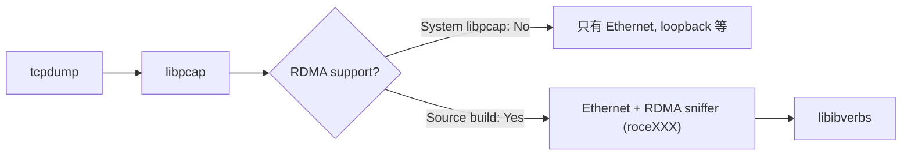

# 在 NVIDIA GB10 上 compile 支援 RDMA sniffer 的 tcpdump

## 背景

我有一台 NVIDIA Project Digits GB10（Grace Blackwell），上面有 InfiniBand / RoCE network interface。在 debug 網路問題時想用 `tcpdump` 抓封包，結果發現系統內建的版本完全看不到 RDMA device。

內建的 `tcpdump` 列得出 Ethernet、loopback、Wi-Fi、甚至 D-Bus socket，就是沒有 RDMA sniffer。抓不到 RDMA 封包的話，不管是 debug connectivity、看 performance 還是確認 traffic 有沒有真的走 RDMA path，都是瞎猜。

解法：從 source code compile `libpcap` 跟 `tcpdump`。目前版本的 libpcap 有內建 RDMA sniffer module，可以把 RoCE/InfiniBand 的 netdevice 暴露成可以抓封包的 interface。

## 技術概覽

Ubuntu 預裝的 `tcpdump` link 的是系統的 `libpcap`，而這個版本 compile 的時候**沒有**開 RDMA 支援。libpcap 的 RDMA sniffer 功能靠的是 `libibverbs` —— InfiniBand Verbs 的 userspace library —— 來偵測跟 capture RDMA interface 上的封包。

在有裝 `libibverbs` header 的系統上從 source compile libpcap，`./configure` 會自動偵測到然後啟用 RDMA sniffer module。這樣 RDMA device 就會出現在 `tcpdump -D` 裡面（interface name 會是 `roce` 或 `mlx` 開頭）。



## 實作記錄

### STEP 1：檢查內建的 tcpdump

先看內建 tcpdump 能看到哪些 interface：

```console
$ tcpdump -D
libibverbs: Warning: couldn't open config directory '/etc/libibverbs.d'.
libibverbs: Warning: couldn't open config directory '/etc/libibverbs.d'.
1.enP7s7 [Up, Running, Connected]
2.enp1s0f0np0 [Up, Running, Connected]
3.enP2p1s0f0np0 [Up, Running, Connected]
4.flannel.1 [Up, Running, Connected]
5.cni0 [Up, Running, Connected]
6.any (Pseudo-device that captures on all interfaces) [Up, Running]
7.lo [Up, Running, Loopback]
8.wlP9s9 [Up, Wireless, Not associated]
9.enp1s0f1np1 [Up, Disconnected]
10.enP2p1s0f1np1 [Up, Disconnected]
11.docker0 [Up, Disconnected]
12.bluetooth-monitor (Bluetooth Linux Monitor) [Wireless]
13.nflog (Linux netfilter log (NFLOG) interface) [none]
14.nfqueue (Linux netfilter queue (NFQUEUE) interface) [none]
15.dbus-system (D-Bus system bus) [none]
16.dbus-session (D-Bus session bus) [none]
```

完全沒有 RDMA interface。`libibverbs` 的 warning 暗示系統知道 InfiniBand 的存在，但 tcpdump 的 libpcap 沒有 compile 進 RDMA 支援。

### STEP 2：移除內建的 tcpdump

```console
$ sudo apt remove tcpdump
```

### STEP 3：下載 libpcap 跟 tcpdump source

```console
$ mkdir ~/tmp && cd ~/tmp
$ curl -O https://www.tcpdump.org/release/libpcap-1.10.6.tar.xz
$ curl -O https://www.tcpdump.org/release/tcpdump-4.99.6.tar.xz
$ tar xf libpcap-1.10.6.tar.xz
$ tar xf tcpdump-4.99.6.tar.xz
```

### STEP 4：compile 並安裝 libpcap

```console
$ cd libpcap-1.10.6/
$ ./configure
$ make
$ sudo make install
```

確認 library 有裝好：

```console
$ ls /usr/local/lib/
libpcap.a  libpcap.so  libpcap.so.1  libpcap.so.1.10.6  pkgconfig  python3.12
```

### STEP 5：compile 並安裝 tcpdump

```console
$ cd ../tcpdump-4.99.6/
$ ./configure
$ make
$ sudo make install
```

確認 binary 有裝好：

```console
$ ls /usr/local/bin/tcpdump
/usr/local/bin/tcpdump
```

### STEP 6：確認 RDMA interface 出現了

```console
$ tcpdump -D
1.enP7s7 [Up, Running, Connected]
2.enp1s0f0np0 [Up, Running, Connected]
3.enP2p1s0f0np0 [Up, Running, Connected]
4.flannel.1 [Up, Running, Connected]
5.cni0 [Up, Running, Connected]
6.any (Pseudo-device that captures on all interfaces) [Up, Running]
7.lo [Up, Running, Loopback]
8.wlP9s9 [Up, Wireless, Not associated]
9.enp1s0f1np1 [Up, Disconnected]
10.enP2p1s0f1np1 [Up, Disconnected]
11.docker0 [Up, Disconnected]
12.nflog (Linux netfilter log (NFLOG) interface) [none]
13.nfqueue (Linux netfilter queue (NFQUEUE) interface) [none]
14.rocep1s0f0 (RDMA sniffer)
15.rocep1s0f1 (RDMA sniffer)
16.roceP2p1s0f0 (RDMA sniffer)
17.roceP2p1s0f1 (RDMA sniffer)
```

4 個 RDMA sniffer interface 出現了（`rocep1s0f0`、`rocep1s0f1`、`roceP2p1s0f0`、`roceP2p1s0f1`），對應 GB10 上的 RoCE netdevice。`libibverbs` 的 warning 也沒了。

## Key Takeaways

- **Ubuntu 內建的 tcpdump 沒有 RDMA 支援。** 系統裝的 libpcap compile 時沒有包含 RDMA sniffer module，不管硬體有沒有支援，`tcpdump -D` 都不會顯示 RDMA interface。
- **從 source compile 就能解決。** 只要系統上有 `libibverbs` header（GB10 預設就有），compile libpcap 會自動偵測並啟用 RDMA sniffer。
- **整個過程不到 5 分鐘。** download、configure、make、install，不用任何 patch 或特殊 flag。
- **注意 library path。** Source build 的 libpcap 裝到 `/usr/local/lib/`，通常在預設 search path 裡。如果 tcpdump 找不到的話跑一下 `sudo ldconfig`。

## References

- [tcpdump official releases](https://www.tcpdump.org/#latest-releases)
- [libpcap official releases](https://www.tcpdump.org/#latest-releases)
- [libpcap RDMA sniffer support (pcap-rdmasniff.c)](https://github.com/the-tcpdump-group/libpcap/blob/master/pcap-rdmasniff.c)
- [NVIDIA GB10 (Project Digits)](https://www.nvidia.com/en-us/project-digits/)
