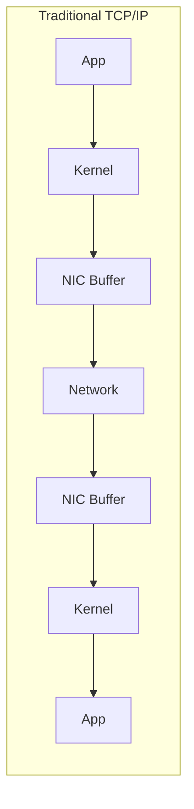
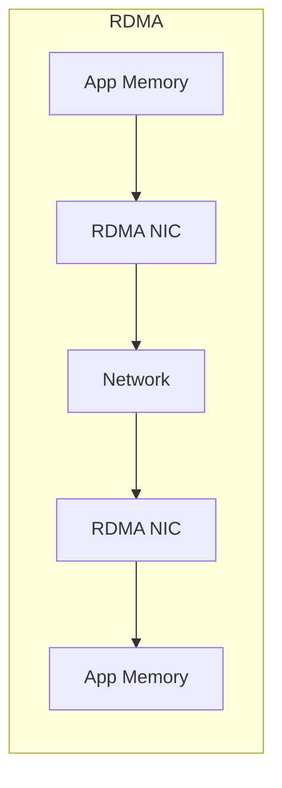

# RDMA, GPUDirect, and the PCIe BAR Rabbit Hole

## Context

Last year I was setting up an NVIDIA RTX PRO 6000 on a server. To squeeze out max performance, I used NVIDIA's `displaymodeselector` to switch the card to Compute mode. Rebooted. Card was dead:

```
[    5.015146] NVRM: This PCI I/O region assigned to your NVIDIA device is invalid:
               NVRM: BAR0 is 0M @ 0x0 (PCI:0000:c1:00.0)
[    5.017631] nvidia 0000:c1:00.0: probe with driver nvidia failed with error -1
...
[    5.028313] NVRM: The NVIDIA probe routine failed for 1 device(s).
```

Running `displaymodeselector` again didn't help either:

```console
$ sudo ./displaymodeselector
terminate called after throwing an instance of 'std::runtime_error'
  what():  The PCI BAR assignment for the processed device is invalid.
Please check with NVIDIA web site for possible SBIOS Setup setting
to fit with the processed device.

Aborted
```

Brand new card, bricked on day one. Not a great feeling.

But the `PCI BAR assignment invalid` message was a useful hint. After a day of research, the fix turned out to be:

1. BIOS: set **Above 4G Decoding** to **Enable**
2. BIOS: set **Re-Size BAR Support** to **Enable**
3. GRUB: add kernel parameter `pci=realloc=off`

Reboot. Card came back. But this sent me down a rabbit hole: what do these settings actually do? Why does a GPU need them? The answer connects DMA, RDMA, and GPUDirect in a chain.

## From DMA to RDMA

### DMA: freeing the CPU from data copying

Before DMA (Direct Memory Access), the CPU had to manually copy every byte of data between devices and memory. Huge waste of CPU cycles.

DMA fixed this: hardware devices (NICs, disks, etc.) can read/write System RAM directly. CPU just waits for an interrupt when the transfer is done.

### RDMA: DMA across the network

As large-scale compute clusters and distributed systems grew, data needed to move not just within a single machine but across the network. Traditional TCP/IP is CPU-intensive -- data gets copied between NIC hardware buffers, kernel space, and user space.

RDMA (Remote DMA) eliminates this bottleneck. Machine A's NIC can write data directly into Machine B's system memory over the network. Zero-copy, bypasses the OS kernel, doesn't consume CPU, and brings network latency down to the microsecond range.





## Why Re-Size BAR Matters

Back to the original problem: RDMA sounds great, but what does it have to do with the RTX PRO 6000 not booting?

A GPU is essentially a standalone subsystem with its own compute units and dedicated VRAM. When the CPU or other devices need to access GPU VRAM, they go through **MMIO (Memory Mapped I/O)** on the PCIe Bus -- the BIOS carves out a region in the system's physical address space and maps it to the GPU's VRAM.

The problem:

- **32-bit era limitation**: PCIe devices get only 256MB of MMIO space by default (the Base Address Register, BAR). For a 96GB GPU, the CPU has to constantly swap this 256MB mapping window back and forth to access different parts of VRAM. Extremely inefficient.
- **Above 4G Decoding**: Enables 64-bit addressing so BARs can be placed above the 4GB address boundary.
- **Re-Size BAR**: Lets the GPU request a contiguous address region matching the full VRAM size. No more window swapping.
- **`pci=realloc=off`**: Prevents the Linux kernel from reallocating the BAR mappings that BIOS already set up.

With all three settings in place, the GPU's entire VRAM is exposed as a contiguous region in the PCIe address space.

## RDMA + GPU: GPUDirect

Once the full VRAM address space is exposed on the PCIe bus, RDMA NICs sitting on the same bus gain a completely new capability.

**Traditional TCP/IP data path:**

```
GPU A → System RAM A → NIC A → Network → NIC B → System RAM B → GPU B
```

**With Re-Size BAR + GPUDirect RDMA:**

```
GPU A → RDMA NIC A → Network → RDMA NIC B → GPU B
```

The RDMA NIC can directly "see" the GPU VRAM addresses. When it receives data from the remote side, it writes directly into GPU VRAM via the PCIe Bus -- completely bypassing System RAM and CPU.

This is **GPUDirect RDMA** in the NVIDIA ecosystem. It's the key technology enabling extreme throughput in multi-node, multi-GPU AI/LLM training and inference.

## InfiniBand vs. RoCE

RDMA is the underlying architecture. Two major implementations dominate:

| | InfiniBand (IB) | RoCE v2 |
|---|---|---|
| **Origin** | Proprietary standard, pushed hard by NVIDIA post-Mellanox acquisition | Developed by cloud and networking vendors to break the monopoly |
| **Design** | Hardware and protocol purpose-built for max performance | RDMA protocol running on standard Ethernet |
| **Bandwidth** | Very high (400Gbps NDR) | High (100/200/400GbE) |
| **Lossless** | Native hardware support | Requires switch QoS config (PFC/ECN) |
| **Cost** | Expensive, locked into NVIDIA ecosystem | More affordable, wider switch selection |
| **Best for** | Max-performance HPC/AI clusters | Cost-sensitive large-scale RDMA deployments |

## NVIDIA GPUDirect vs. DMA-BUF

Beyond cross-machine RDMA, single-machine PCIe P2P (Peer-to-Peer) DMA also differs between GPU vendors:

- **NVIDIA GPUDirect**: Proprietary driver and API. If you buy the full NVIDIA stack, everything works out of the box. Downside: vendor lock-in and cost.
- **AMD dma-buf**: Uses the Linux kernel's native `dma-buf` framework -- a standard DMA buffer sharing mechanism. Allows different hardware (AMD GPUs, NICs, NVMe SSDs) to share memory addresses and perform direct DMA transfers without CPU involvement. Open standard, no vendor lock-in.

## Key Takeaways

- **GPU "bricking" is usually a BIOS PCIe BAR config issue**, not dead hardware. Enable Above 4G Decoding + Re-Size BAR + `pci=realloc=off` together.
- **Re-Size BAR isn't just a performance optimization** -- it's a prerequisite for GPUDirect RDMA. The RDMA NIC needs to see the full VRAM address space.
- **RDMA bypasses CPU and OS kernel**, bringing cross-machine GPU-to-GPU transfer latency down to microseconds.
- **InfiniBand delivers the best performance but costs the most**. RoCE is the balance between cost and performance.
- **In the LLM era, compute matters, but data movement speed matters just as much** -- it's the bottleneck that limits multi-GPU training efficiency.

## References

- [NVIDIA GPUDirect RDMA documentation](https://docs.nvidia.com/cuda/gpudirect-rdma/)
- [PCIe Base Address Register (BAR) - OSDev Wiki](https://wiki.osdev.org/PCI#Base_Address_Registers)
- [Resizable BAR - Wikipedia](https://en.wikipedia.org/wiki/PCI_Express#Resizable_BAR)
- [Linux kernel dma-buf documentation](https://www.kernel.org/doc/html/latest/driver-api/dma-buf.html)
- [RoCE v2 - RDMA over Converged Ethernet](https://en.wikipedia.org/wiki/RDMA_over_Converged_Ethernet)
- [NVIDIA displaymodeselector tool](https://developer.nvidia.com/displaymodeselector)
