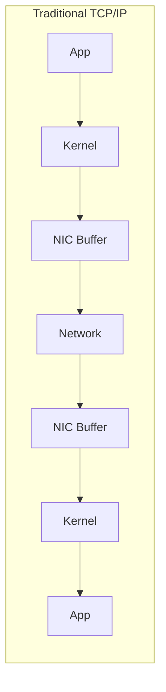
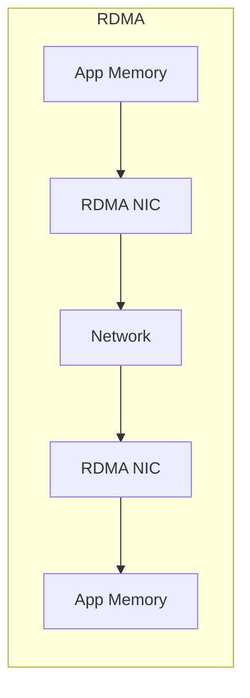

# RDMA、GPUDirect 與那個讓 GPU 變磚的 PCIe BAR 設定

## 背景

去年，我在一台 server 上設定 NVIDIA RTX PRO 6000。為了把 GPU 切到 Compute mode 榨出最大效能，用了 NVIDIA 的 `displaymodeselector` 工具。重開機之後，卡直接掛了：

```
[    5.015146] NVRM: This PCI I/O region assigned to your NVIDIA device is invalid:
               NVRM: BAR0 is 0M @ 0x0 (PCI:0000:c1:00.0)
[    5.017631] nvidia 0000:c1:00.0: probe with driver nvidia failed with error -1
...
[    5.028313] NVRM: The NVIDIA probe routine failed for 1 device(s).
```

再跑一次 `displaymodeselector` 也沒用：

```console
$ sudo ./displaymodeselector
terminate called after throwing an instance of 'std::runtime_error'
  what():  The PCI BAR assignment for the processed device is invalid.
Please check with NVIDIA web site for possible SBIOS Setup setting
to fit with the processed device.

Aborted
```

剛拿到的卡就變磚了，當下心涼了一半。

不過 log 裡的 `PCI BAR assignment invalid` 給了 hint。研究了一天，找到解法：

1. BIOS 把 **Above 4G Decoding** 設為 **Enable**
2. BIOS 把 **Re-Size BAR Support** 設為 **Enable**
3. GRUB 加上 kernel parameter `pci=realloc=off`

重開機，問題解決。但這讓我開始想：這些設定到底在做什麼？為什麼一張 GPU 需要這些東西才能活？答案牽涉到 DMA、RDMA、GPUDirect 一整條技術鏈。

## 從 DMA 到 RDMA

### DMA：讓 CPU 不用自己搬資料

在沒有 DMA (Direct Memory Access) 之前，CPU 要自己動手搬資料，全程參與，浪費大量 CPU cycle。

DMA 解決了這個問題：硬體裝置（網卡、硬碟等）可以直接讀寫 System RAM，CPU 只要等 interrupt 通知就好，中間可以去做其他事。

### RDMA：跨網路的 DMA

隨著大型運算中心跟分散式系統發展，資料不只在單機內搬，還要跨網路到另一台機器。傳統 TCP/IP 非常吃 CPU -- 資料必須在網卡 hardware buffer、kernel space 跟 user space 之間來回 copy。

RDMA (Remote DMA) 就是為了解決這個瓶頸。顧名思義，A 機器的網卡可以透過網路，直接把資料寫進 B 機器的 system memory。Zero-copy，不經過 OS kernel、不佔 CPU，網路延遲降到 microsecond 等級。





## 為什麼需要 Re-Size BAR

回到原本的問題：RDMA 聽起來很讚，但跟 RTX PRO 6000 起不來有什麼關係？

GPU 對系統來說是一套完全獨立的子系統，有自己的運算單元跟獨立的 VRAM。CPU 或其他裝置要存取 GPU 的 VRAM，必須透過 PCIe Bus 上的 **MMIO (Memory Mapped I/O)** -- BIOS 在系統的 physical address space 中劃出一塊空間，mapping 到 GPU 的 VRAM。

問題在於：

- **32-bit 時代的限制**：PCIe device 預設只能要到 256MB 的 MMIO 空間（就是 Base Address Register, BAR）。96GB 的 GPU 只有 256MB 的 window，CPU 要像翻字典一樣不斷切換這個 mapping window 來讀寫，效率很差。
- **Above 4G Decoding**：打開 64-bit addressing，讓 BAR 可以分配到 4GB 以上的 address space。
- **Re-Size BAR**：讓 GPU 可以跟系統要一塊跟 VRAM 一樣大的連續 address space，不用再透過小 window 來回切換。
- **`pci=realloc=off`**：防止 Linux kernel 重新分配 BIOS 已經安排好的 BAR mapping，避免打亂設定。

當這些設定生效，整塊 GPU 的 VRAM 就完整地 expose 在 PCIe 的 address space 中了。

## RDMA + GPU：GPUDirect

當 VRAM 的 address 被完全展開在 PCIe address space 後，同樣在 PCIe Bus 上的 RDMA 網卡就完全不一樣了。

**傳統 TCP/IP 的資料路徑：**

```
A 機 GPU → A 機 System RAM → A 機網卡 → 網路 → B 機網卡 → B 機 System RAM → B 機 GPU
```

**有了 Re-Size BAR + GPUDirect RDMA：**

```
A 機 GPU → A 機 RDMA 網卡 → 網路 → B 機 RDMA 網卡 → B 機 GPU
```

因為 RDMA 網卡可以直接「看見」GPU VRAM 的 address，收到遠端資料後，直接透過 PCIe Bus 寫進 GPU 的 VRAM，完全繞過 System RAM 跟 CPU。

這就是 NVIDIA 生態系裡的 **GPUDirect RDMA**。它是 AI/LLM 在多機多卡 training 跟 inference 時能達到極高 throughput 的技術關鍵。

## InfiniBand vs. RoCE

RDMA 是底層架構，目前市場上有兩大主流實作：

| | InfiniBand (IB) | RoCE v2 |
|---|---|---|
| **背景** | NVIDIA 收購 Mellanox 後力推的專屬網路標準 | 雲端大廠跟網路廠商為了打破壟斷而發展 |
| **設計理念** | 從硬體到 protocol 都為極致效能而生 | 在傳統 Ethernet 上跑 RDMA protocol |
| **頻寬** | 極高（400Gbps NDR） | 高（100/200/400GbE） |
| **無損傳輸** | 硬體原生支援 Lossless | 需要透過 switch 的 QoS 設定（PFC/ECN） |
| **成本** | 貴，且被 NVIDIA 生態系綁定 | 相對便宜，switch 選擇多 |
| **適用場景** | 追求極致效能的 HPC/AI cluster | 成本敏感但仍需 RDMA 的大規模部署 |

## NVIDIA GPUDirect vs. DMA-BUF

除了跨機的 RDMA，單機內部的 PCIe P2P (Peer-to-Peer) DMA 傳輸，各家 GPU 廠商做法也不同：

- **NVIDIA GPUDirect**：自家封閉的 driver 跟 API。買全套 NVIDIA 設備就一次搞定，缺點是被綁定，而且貴。
- **AMD dma-buf**：用 Linux kernel 原生的 `dma-buf` framework。這是標準的 DMA buffer sharing 機制，允許不同硬體（AMD GPU、網卡、NVMe SSD）在不經過 CPU 的情況下互相分享 memory address，直接做 DMA 傳輸。開放標準，不被單一廠商綁定。

## Key Takeaways

- **GPU 變磚通常是 BIOS 的 PCIe BAR 設定問題**，不是硬體壞了。Above 4G Decoding + Re-Size BAR + `pci=realloc=off` 三個一起開。
- **Re-Size BAR 不只是效能優化** -- 它是讓 GPUDirect RDMA 能 work 的前提。RDMA 網卡需要看到完整的 VRAM address space。
- **RDMA 繞過了 CPU 跟 OS kernel**，把跨機 GPU-to-GPU 的傳輸延遲降到 microsecond 等級。
- **InfiniBand 效能最好但最貴**，RoCE 是成本跟效能的平衡點。
- **在 LLM 時代，算力很重要，但搬資料的速度一樣重要** -- 因為這是多卡 training 會卡住效率的關鍵瓶頸。

## References

- [NVIDIA GPUDirect RDMA documentation](https://docs.nvidia.com/cuda/gpudirect-rdma/)
- [PCIe Base Address Register (BAR) - OSDev Wiki](https://wiki.osdev.org/PCI#Base_Address_Registers)
- [Resizable BAR - Wikipedia](https://en.wikipedia.org/wiki/PCI_Express#Resizable_BAR)
- [Linux kernel dma-buf documentation](https://www.kernel.org/doc/html/latest/driver-api/dma-buf.html)
- [RoCE v2 - RDMA over Converged Ethernet](https://en.wikipedia.org/wiki/RDMA_over_Converged_Ethernet)
- [NVIDIA displaymodeselector tool](https://developer.nvidia.com/displaymodeselector)
