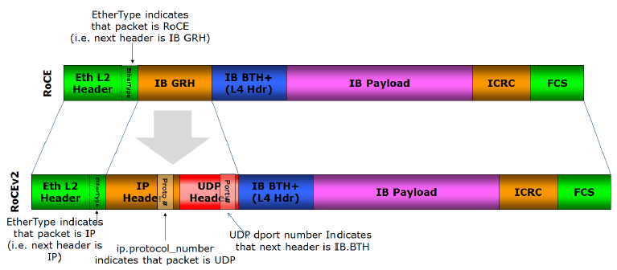
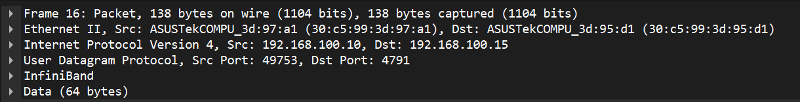
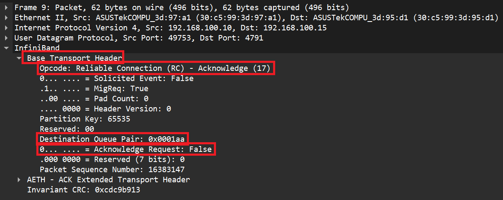
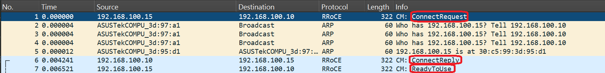

# RoCEv2 Hands-on: Parameters, rping Testing, and Packet Capture

## Context

The [previous article covered RDMA and GPUDirect fundamentals](rdma-gpudirect-and-the-pcie-bar-rabbit-hole.md). This one is the practical follow-up. RoCEv2 is the dominant RDMA transport today, so that's what we'll use here.

Environment: two NVIDIA GB10 machines, each with 4 PCIe ConnectX-7 NICs, connected back-to-back via RoCE ports.

## Environment Check

### Hardware

4 ConnectX-7 cards visible on the GB10:

```console
sean@gb10-1:~$ lspci | grep Mellanox
0000:01:00.0 Ethernet controller: Mellanox Technologies MT2910 Family [ConnectX-7]
0000:01:00.1 Ethernet controller: Mellanox Technologies MT2910 Family [ConnectX-7]
0002:01:00.0 Ethernet controller: Mellanox Technologies MT2910 Family [ConnectX-7]
0002:01:00.1 Ethernet controller: Mellanox Technologies MT2910 Family [ConnectX-7]
```

### RDMA Link Status

```console
sean@gb10-1:~$ rdma link
link rocep1s0f0/1 state ACTIVE physical_state LINK_UP netdev enp1s0f0np0
link rocep1s0f1/1 state DOWN physical_state DISABLED netdev enp1s0f1np1
link roceP2p1s0f0/1 state ACTIVE physical_state LINK_UP netdev enP2p1s0f0np0
link roceP2p1s0f1/1 state DOWN physical_state DISABLED netdev enP2p1s0f1np1
```

2 ports ACTIVE, 2 DOWN (no cable).

### RDMA Device to Network Interface Mapping

`ibdev2netdev` shows which RDMA device maps to which network interface:

```console
sean@gb10-1:~$ ibdev2netdev
rocep1s0f0 port 1 ==> enp1s0f0np0 (Up)
rocep1s0f1 port 1 ==> enp1s0f1np1 (Down)
roceP2p1s0f0 port 1 ==> enP2p1s0f0np0 (Up)
roceP2p1s0f1 port 1 ==> enP2p1s0f1np1 (Down)
```

## RoCEv2 Key Parameters

### GID (Global Identifier)

GID is the endpoint identifier in RDMA communication -- analogous to IP addresses in TCP/IP. Each RDMA port has a GID table with multiple entries.

`show_gids` dumps the full GID table:

```console
sean@gb10-1:~$ show_gids
DEV     PORT    INDEX   GID                                     IPv4            VER     DEV
---     ----    -----   ---                                     ------------    ---     ---
rocep1s0f0      1       0       fe80:0000:0000:0000:xxxx:xxxx:xxxx:xxxx                 v1      enp1s0f0np0
rocep1s0f0      1       1       fe80:0000:0000:0000:xxxx:xxxx:xxxx:xxxx                 v2      enp1s0f0np0
rocep1s0f0      1       2       0000:0000:0000:0000:0000:ffff:c0a8:640a 192.168.100.10          v1      enp1s0f0np0
rocep1s0f0      1       3       0000:0000:0000:0000:0000:ffff:c0a8:640a 192.168.100.10          v2      enp1s0f0np0
rocep1s0f1      1       0       fe80:0000:0000:0000:xxxx:xxxx:xxxx:xxxx                 v1      enp1s0f1np1
rocep1s0f1      1       1       fe80:0000:0000:0000:xxxx:xxxx:xxxx:xxxx                 v2      enp1s0f1np1
roceP2p1s0f0    1       0       fe80:0000:0000:0000:xxxx:xxxx:xxxx:xxxx                 v1      enP2p1s0f0np0
roceP2p1s0f0    1       1       fe80:0000:0000:0000:xxxx:xxxx:xxxx:xxxx                 v2      enP2p1s0f0np0
roceP2p1s0f0    1       2       0000:0000:0000:0000:0000:ffff:c0a8:640e 192.168.100.14          v1      enP2p1s0f0np0
roceP2p1s0f0    1       3       0000:0000:0000:0000:0000:ffff:c0a8:640e 192.168.100.14          v2      enP2p1s0f0np0
roceP2p1s0f1    1       0       fe80:0000:0000:0000:xxxx:xxxx:xxxx:xxxx                 v1      enP2p1s0f1np1
roceP2p1s0f1    1       1       fe80:0000:0000:0000:xxxx:xxxx:xxxx:xxxx                 v2      enP2p1s0f1np1
n_gids_found=12
```

Key points:

- **VER column**: `v1` = RoCEv1 (L2 only), `v2` = RoCEv2 (L3 routable, uses UDP). For RoCEv2 traffic, pick a `v2` GID index.
- **IPv4 column**: Entries with IPs are derived from the corresponding network interface. E.g., `192.168.100.10` comes from `enp1s0f0np0`.
- **Link-local (`fe80::`)**: Auto-generated link-local GIDs derived from the NIC's MAC address. Used for same-L2-segment communication.
- **GID Index**: Many RDMA tools (`ib_write_bw`, `ibv_rc_pingpong`, etc.) require specifying a GID index. For RoCEv2, pick the `v2` entry with IPv4 mapping -- on this machine, that's index `3`.

## Testing RDMA with rping

With the parameters confirmed, start with `rping` to verify RDMA connectivity. It's the simplest tool for a quick sanity check.

### Server Side

Start `tcpdump` to capture RDMA traffic. If tcpdump can't see RoCE packets, see [Building tcpdump with RDMA Sniffing Support on NVIDIA GB10](building-tcpdump-with-rdma-support-on-nvidia-gb10.md).

```console
sean@gb10-1:~$ sudo tcpdump -i rocep1s0f0 -w dump.pcap
[sudo] password for sean:
tcpdump: listening on rocep1s0f0, link-type EN10MB (Ethernet), snapshot length 10000 bytes
205 packets captured
205 packets received by filter
0 packets dropped by kernel
```

Start the rping server:

```console
sean@gb10-1:~$ rping -s -a 192.168.100.10
server DISCONNECT EVENT...
wait for RDMA_READ_ADV state 10
```

### Client Side

From the other machine, run rping. `-C 10` sends 10 pings, `-v` enables verbose output:

```console
sean@gb10-2:~$ rping -c -a 192.168.100.10 -C 10 -v
ping data: rdma-ping-0: ABCDEFGHIJKLMNOPQRSTUVWXYZ[\]^_`abcdefghijklmnopqr
ping data: rdma-ping-1: BCDEFGHIJKLMNOPQRSTUVWXYZ[\]^_`abcdefghijklmnopqrs
ping data: rdma-ping-2: CDEFGHIJKLMNOPQRSTUVWXYZ[\]^_`abcdefghijklmnopqrst
ping data: rdma-ping-3: DEFGHIJKLMNOPQRSTUVWXYZ[\]^_`abcdefghijklmnopqrstu
ping data: rdma-ping-4: EFGHIJKLMNOPQRSTUVWXYZ[\]^_`abcdefghijklmnopqrstuv
ping data: rdma-ping-5: FGHIJKLMNOPQRSTUVWXYZ[\]^_`abcdefghijklmnopqrstuvw
ping data: rdma-ping-6: GHIJKLMNOPQRSTUVWXYZ[\]^_`abcdefghijklmnopqrstuvwx
ping data: rdma-ping-7: HIJKLMNOPQRSTUVWXYZ[\]^_`abcdefghijklmnopqrstuvwxy
ping data: rdma-ping-8: IJKLMNOPQRSTUVWXYZ[\]^_`abcdefghijklmnopqrstuvwxyz
ping data: rdma-ping-9: JKLMNOPQRSTUVWXYZ[\]^_`abcdefghijklmnopqrstuvwxyzA
client DISCONNECT EVENT...
```

All 10 RDMA pings succeeded with the characteristic shifting ASCII payload. `DISCONNECT EVENT` means the client closed the connection cleanly.

## RDMA Bandwidth Test with ib_write_bw

`rping` only verifies connectivity. To measure actual throughput, use `ib_write_bw`.

### Server Side

```console
sean@gb10-1:~$ ib_write_bw -d rocep1s0f0
```

### Client Side

`-D 10` runs for 10 seconds, `--report_gbits` reports in Gbps, `--cpu_util` shows CPU usage:

```console
sean@gb10-2:~$ ib_write_bw -d roceP2p1s0f0 -D 10 --cpu_util --report_gbits 192.168.100.10
---------------------------------------------------------------------------------------
                    RDMA_Write BW Test
 Dual-port       : OFF          Device         : roceP2p1s0f0
 Number of qps   : 1            Transport type : IB
 Connection type : RC           Using SRQ      : OFF
 PCIe relax order: ON
 ibv_wr* API     : ON
 TX depth        : 128
 CQ Moderation   : 1
 Mtu             : 1024[B]
 Link type       : Ethernet
 GID index       : 3
 Max inline data : 0[B]
 rdma_cm QPs     : OFF
 Data ex. method : Ethernet
---------------------------------------------------------------------------------------
 local address: LID 0000 QPN 0xxxxx PSN 0xxxxxx RKey 0xxxxxx VAddr 0xxxxxxxxxxx
 GID: 00:00:00:00:00:00:00:00:00:00:255:255:192:168:100:15
 remote address: LID 0000 QPN 0xxxxx PSN 0xxxxxx RKey 0xxxxxx VAddr 0xxxxxxxxxxx
 GID: 00:00:00:00:00:00:00:00:00:00:255:255:192:168:100:10
---------------------------------------------------------------------------------------
 #bytes     #iterations    BW peak[Gb/sec]    BW average[Gb/sec]   MsgRate[Mpps]    CPU_Util[%]
 65536      1059332          0.00               92.57              0.176557         5.07
---------------------------------------------------------------------------------------
```

Notable results:

- **BW average 92.57 Gbps**: Two GB10s back-to-back, ConnectX-7 pushing near 100GbE line rate.
- **CPU_Util 5.07%**: RDMA kernel bypass in action -- CPU is barely involved, the RNIC handles data transfer.
- **GID index 3**: Auto-selected the `v2` IPv4-mapped GID, consistent with what `show_gids` showed earlier.
- **Connection type RC**: Reliable Connection with ACK-based delivery guarantee.
- **Mtu 1024**: This is IB MTU, not Ethernet MTU. IB MTU 1024 bytes is the RoCEv2 default.

## RoCEv2 Packet Analysis

### Frame Structure Comparison

<figure markdown="span">
  
  <figcaption>RoCE & RoCEv2 Frame Structure</figcaption>
</figure>

Open `dump.pcap` in Wireshark to see the actual captured RoCEv2 frames:

<figure markdown="span">
  
  <figcaption>RoCEv2 frame in Wireshark</figcaption>
</figure>

Comparing the two confirms the test traffic is RoCEv2. The clearest indicator: the **IP + UDP encapsulation**. RoCEv1 runs directly on Ethernet with no IP or UDP layer. RoCEv2 wraps everything in UDP (destination port 4791), making it L3-routable.

### IB BTH (Base Transport Header)

<figure markdown="span">
  
  <figcaption>IB BTH (Base Transport Header)</figcaption>
</figure>

After the IP/UDP headers comes the InfiniBand BTH (Base Transport Header). Key fields:

- **Opcode**: The RDMA operation type for this packet -- RDMA_WRITE, RDMA_READ, SEND, etc.
- **Destination QP**: The target Queue Pair number. Routes the packet to the correct QP on the receiver.
- **Acknowledge Request**: Tells the receiver whether to send back an ACK for this packet.

### rping's Actual RDMA Operations in the Capture

Each rping iteration exercises 3 RDMA operation types in sequence:

1. **SEND**: Client sends the ping data to the server. SEND is the most basic RDMA operation, similar to traditional socket send/recv -- the receiver must have a Receive Work Request pre-posted.
2. **RDMA_READ**: After receiving the SEND, the server issues an RDMA_READ to read data directly from the client's memory. This is initiated entirely by the server's RNIC; the client's CPU is not involved.
3. **RDMA_WRITE**: The server then issues an RDMA_WRITE to write data directly into the client's memory. Like RDMA_READ, the client's CPU has no knowledge of this happening.

In Wireshark, the corresponding BTH Opcodes appear in alternating sequence. This is what makes `rping` valuable beyond a simple connectivity check -- it validates that SEND, RDMA_READ, and RDMA_WRITE all work correctly.

### RoCEv2 Connection Manager Setup

<figure markdown="span">
  
  <figcaption>RoCEv2 Connection Manager handshake</figcaption>
</figure>

The highlighted section shows the RoCEv2 connection setup via RDMA Connection Manager (CM).

The fundamental difference from TCP: **TCP connection setup synchronizes software protocol stack state. RoCEv2 connection setup allocates hardware Queue Pair resources, transitions their state machines, and exchanges memory keys.**

**TCP/IP: Three-way Handshake**

Flow: `SYN → SYN-ACK → ACK`

- Synchronizes Initial Sequence Numbers (ISN), confirms window sizes, negotiates TCP options (MSS, SACK, etc.).
- Kernel allocates socket buffers in memory.
- The entire connection lifecycle is managed by the OS kernel's TCP/IP protocol stack.

**RoCEv2: RDMA CM Handshake**

Flow: `REQ → REP → RTU`

- **REQ (Connection Request)**: Initiator sends its Queue Pair Number (QPN), initial Packet Sequence Number (PSN), and Private Data.
- **REP (Connection Reply)**: Responder allocates hardware resources and replies with its own QPN and PSN.
- **RTU (Ready to Use)**: Initiator confirms. Both sides are ready for RDMA data transfer.

At the core of this process is the **Queue Pair (QP)** -- each QP contains a Send Queue and a Receive Queue. Before connection setup, the application requests a QP from the RNIC (RDMA NIC). The initial QP state is RESET.

As the CM handshake progresses, the RNIC's hardware state machine drives the QP through state transitions:

```
RESET → INIT → RTR (Ready to Receive) → RTS (Ready to Send)
```

Once in RTS state, all subsequent data transfers are handled entirely by the RNIC hardware -- no OS kernel or CPU involvement. This is RDMA's zero-copy + kernel bypass in action.

## Key Takeaways

- **`rdma link` and `ibdev2netdev`** are the fastest way to verify the RDMA environment.
- **The GID table is foundational for RoCEv2**. Use `show_gids`. For RoCEv2, pick the `v2` entry with IPv4 mapping.
- **`rping` does more than test connectivity** -- it validates SEND, RDMA_READ, and RDMA_WRITE in a single run.
- **`ib_write_bw` hit 92.57 Gbps with only 5% CPU usage** -- RDMA kernel bypass keeps the CPU almost entirely out of the data path.
- **tcpdump can capture RoCE packets**, but you need a source-built version. The resulting `.pcap` opens in Wireshark for RoCEv2 frame analysis.
- **The key visual difference between RoCEv2 and RoCEv1 is the IP + UDP encapsulation**, which makes RDMA traffic L3-routable.
- **RoCEv2 connection setup is hardware-level resource allocation** (QP allocation + state machine transitions), fundamentally different from TCP's software protocol stack synchronization. Once the QP reaches RTS state, the RNIC hardware takes over all data transfer.

## References

- [Mellanox OFED - show_gids documentation](https://docs.nvidia.com/networking/display/mlnxofedv24010331/show_gids)
- [rdma-core rping man page](https://man7.org/linux/man-pages/man1/rping.1.html)
- [Mellanox perftest (ib_write_bw)](https://github.com/linux-rdma/perftest)
- [RoCEv2 specification (IBTA)](https://www.roceinitiative.org/)
- [Building tcpdump with RDMA Sniffing Support on NVIDIA GB10](building-tcpdump-with-rdma-support-on-nvidia-gb10.md)
- [RDMA, GPUDirect, and the PCIe BAR Rabbit Hole](rdma-gpudirect-and-the-pcie-bar-rabbit-hole.md)
